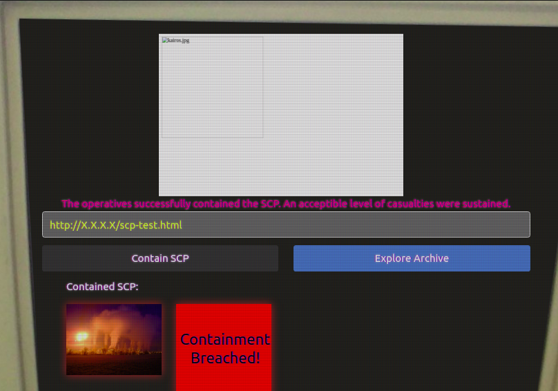

# CSAW Quals 2021

Yesterday we finished playing the Quals of CSAW 2021 CTF, after 48h of hard team work, we (CyberErudites) finished **2nd** in MENA Region, and **30th** worldwide.

This is a writeup for the web challenge `SCP-Terminal`

## Description


## Writeup

Upon opening the challenge link, we are faced with this page:


Little background before starting the challenge:
The name of the challenge, comes from `SCP foundation`, which according to Wikipedia:

```
The SCP Foundation is a fictional secret organization
documented by the collaborative writing wiki project of
the same name. Within the website's shared universe, the
SCP Foundation is responsible for capturing and containing
various paranormal, supernatural, and other mysterious
phenomena unexplained by mainstream science (referred to
as anomalies or SCPs), while also keeping their existence
hidden from the rest of global human society. The
real-world website is community-based and includes
elements of many genres such as horror, science fiction,
and urban fantasy.
```

If we go to the scp wiki (by clicking on `Explore Archive`), you'll see different type of entities (or items), each item has an ID, it starts with `SCP-` followed by a number.

Knowing that, we'd assume that the input `SCP location` should include a link to an existing SCP item, let's try that, by grabbing one item from the scp wiki and sending it as input:


After a couple of minutes, we get this result:


We notice that the server took a screenshot of the link we sent, as well as extracted the image from the wiki and put it under `Contained SCP` section (remember that, this is important, we'll come to it later).

Now let's try sending any link and see what happens:


Hmm somehow it is invalid.
After a few tries, we noticed that in order for the location to be valid, it must include the word `scp-`
for any url that's easy to achieve, we just append `#scp-` at the end of the url, to make it an anchor


It works, let's try with other schemas, for instance `file://` to read local files


Here we go, we now have an LFI through screenshots :3 

Let's start reading some source files, we started by reading Nginx default config file and we found the file `/server/server.py`, by reading it we also read the following files:


```/server/server.py```


```/server/scp_contain.py```


```/server/scp_secure.py```


```/server/util.py```


In the main file, we notice there is the route `/scp-31337` that renders an html that probably contain the flag.

If we try to read it (by sending `https://scp-terminal.foundation/scp-31337`) we get this screenshot:


Unfortunately, the challenge couldn't be that easy x) the flag is indeed inside the html, but it is redacted.
The goal of the challenge became clear now, we need to find a way to read the unredacted file.

This is where we were stuck,we tried so many things, the first thing we did was trying to read the html source using `view-source:` since this is a chrome bot:


but because the chrome bot was taking a screenshot for only part of the screen, the flag wasn't visible.

This is were we spent most of the time, we thought of two options:

1. Try to read the source using another way instead of `view-source`
2. OR use `view-source` and find a way to scroll to the right to make the flag visible

We also tried to highlight the redacted flag using the `:~:text` url fragment, hoping it will appear, but it wasn't the case

We tried Zooming out the page, Removing the css using external JS code and iframes, but all of that didn't work either, because of CORS and CSP protections.

At this point, we took a step back, because we thought we were too far down the rabbit hole. So we started from the beginning.

We read all the files again, and that's where we remembered the `Contained SCP` section, here is the code responsible for it:


The function is extracting the `src` attribute of an `img` tag, download the url, changing its name, BUT KEEPING THE EXTENSION (only 3 characters)

THAT'S IT :D

We have to setup a custom htmp page, containing the redacted flag as `src`, so that when fetching it will still have the `.html` extension.

```html
<div class="scp-image-block">

</div>
```



But we get Containment breached,

NO WORRIES, we just take the link of the screenshot
and change `archive` with `site_19` because that's where contained SCPs are stored, and also we change `.png` to `.htm` (the last `l` is removed)


we don't have permissions, let's send this link again:


ET VOILA


FLAG:

```
flag{CSP_def3a7s_SCP_n0t_s0_s3cure_n0w_huh}
```