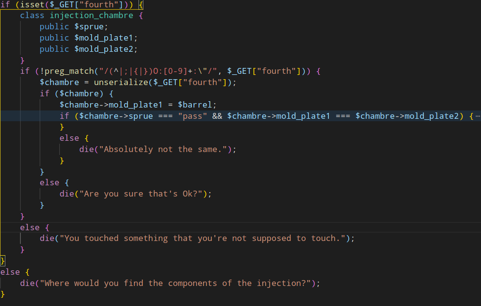
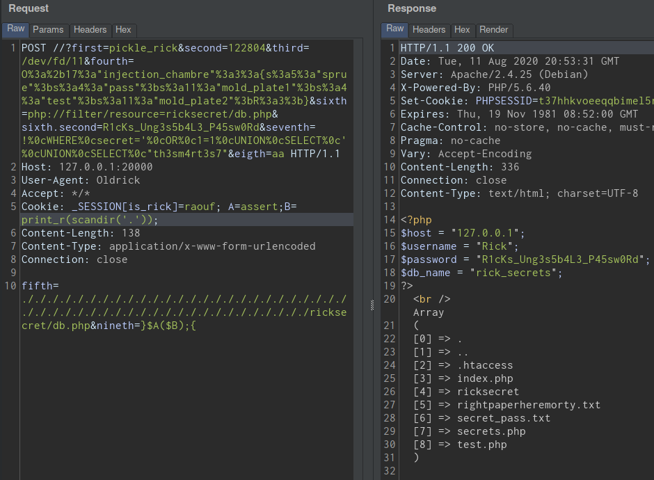

# Poseidon CTF 2020


# Old Rick


## Setup

The challenge is no longer on, so if you want to try it yourself, here'is how to set it up

```
docker pull moonflock/oldrick
```

Then install mysql and do the following to create the user and the necessary tables/rows

```
CREATE USER 'Rick'@'localhost' IDENTIFIED BY 'R1cKs_Ung3s5b4L3_P45sw0Rd';
CREATE DATABASE rick_secrets;
USE rick_secrets;
CREATE TABLE top_secrets (
    id INT(1) UNSIGNED AUTO_INCREMENT PRIMARY KEY,
    secret VARCHAR(255) CHARACTER SET utf8 COLLATE utf8_unicode_ci NOT NULL
);
INSERT INTO top_secrets VALUES(1, 'r1cks');
GRANT SELECT ON rick_secrets.top_secrets TO 'Rick'@'localhost';
```

## Write-up

Upon opening the challenge link, we're faced with a very long source code:

<details>

<summary>

```
<?php
session_start();
$_SESSION["is_rick"] = false;

include "secrets.php"; // storing the variables not declared in this file
include "ricksecret/db.php"; // storing the login credentials for the database

if ($_SERVER["REQUEST_METHOD"] === "POST") {
    if (isset($_GET["first"])) {
        parse_str(parse_url($_SERVER["REQUEST_URI"])["query"], $params);
        if ($params["first"] !== "pickle_rick") {
            if ($_GET["first"] === "pickle_rick") {
```

</summary>

```
                if (isset($_GET["second"])) {
                    $hashed = crypt(md5($_GET["second"], fa1se), "asdf");
                    if (hash_equals($hashed, crypt(md5($hopper, fa1se), "asdf"))) {
                        if (isset($_GET["third"])) {
                            if (strlen($_GET["third"]) <= 10) {
                                $x = fopen("rightpaperheremorty.txt", "r");
                                $tmp = file_get_contents($_GET["third"]);
                                $content = fread($x, filesize("rightpaperheremorty.txt"));
                                if ($tmp === $content) {
                                    fclose($x);
                                    if (isset($_GET["fourth"])) {
                                        class injection_chambre {
                                            public $sprue;
                                            public $mold_plate1;
                                            public $mold_plate2;
                                        }
                                        if (!preg_match("/(^|;|{|})O:[0-9]+:\"/", $_GET["fourth"])) {
                                            $chambre = unserialize($_GET["fourth"]);
                                            if ($chambre) {
                                                $chambre->mold_plate1 = $barrel;
                                                if ($chambre->sprue === "pass" && $chambre->mold_plate1 === $chambre->mold_plate2) {
                                                    if (isset($_POST["fifth"])) {
                                                        $md5sum = md5(trim(file_get_contents("secret_pass.txt")));
                                                        if (preg_match("/\/[a-z\.\/]+$/i", $_POST["fifth"])) {
                                                            if (file_exists($_POST["fifth"]) && substr(md5($_POST["fifth"]), 0, 8) == $md5sum) {
                                                                if (isset($_GET["sixth"])) {
                                                                    if (filter_var($_GET["sixth"], FILTER_VALIDATE_URL)) {
                                                                        $url = parse_url($_GET["sixth"]);
                                                                        if (!preg_match("/tftp|sftp|http|https|file|dict/i", $url["scheme"]) && preg_match("/ricksecret/i", $url["path"]) && !preg_match("/\.\./i", $url["path"]) && !preg_match("/read|base|iconv|zlib/i", $url["path"])) {
                                                                            echo file_get_contents($_GET["sixth"]) . "<br />";
                                                                            if (isset($_GET["sixth_second"])) {
                                                                                if (!preg_match("/sixth_second|sixth second/i", urldecode($_SERVER["QUERY_STRING"]))) {
                                                                                    $dbms = new mysqli($host, $username, $_GET["sixth_second"], $db_name); // There's one row where id=1 and secret='r1cks'
                                                                                    $dbms->set_charset("utf8");
                                                                                    if (!$dbms->connect_error) {
                                                                                        if (isset($_GET["seventh"])) {
                                                                                            if (!preg_match("/\.|_|%|regexp|like|\x09| |\x0d|\x0a|\x0b|\/|\*|x|0|r1cks|\(|\)/i", $_GET["seventh"])) {
                                                                                                $one = "SELECT secret FROM top_secrets WHERE secret='{$_GET["seventh"]}'";
                                                                                                $two = "SELECT secret FROM top_secrets /*{$_GET["seventh"]}*/";
                                                                                                $exe_one = $dbms->query($one);
                                                                                                if ($exe_one->num_rows > 0) {
                                                                                                    $res = $exe_one->fetch_assoc();
                                                                                                    if ($res["secret"] === "r1cks") {
                                                                                                        $exe_two = $dbms->query($two);
                                                                                                        if ($exe_two->num_rows > 0) {
                                                                                                            $res = $exe_two->fetch_assoc();
                                                                                                            if ($res["secret"] === "th3sm4rt3s7") {
                                                                                                                if (isset($_GET["eigth"])) {
                                                                                                                    extract($_COOKIE);
                                                                                                                    if ($_SESSION["is_rick"]) {
                                                                                                                        if (isset($_POST["nineth"])) {
                                                                                                                            $E = $_POST["nineth"];
                                                                                                                            $y = create_function('', substr($E, 0, 12));
                                                                                                                        }
                                                                                                                        else {
                                                                                                                            die("Where would you find the components of the injection?");
                                                                                                                        }
                                                                                                                    }
                                                                                                                    else {
                                                                                                                        die("Access denied for non ricks.");
                                                                                                                    }
                                                                                                                }
                                                                                                                else {
                                                                                                                    die("Where would you find cookies Morty?");
                                                                                                                }
                                                                                                            }
                                                                                                            else {
                                                                                                                $dbms->close();
                                                                                                                die("Oh not again Morty.");
                                                                                                            }
                                                                                                        }
                                                                                                        else {
                                                                                                            $dbms->close();
                                                                                                            die("Maybe somehow close.");
                                                                                                        }
                                                                                                    }
                                                                                                    else {
                                                                                                        $dbms->close();
                                                                                                        die("Wait what's that Morty?");
                                                                                                    }
                                                                                                }
                                                                                                else {
                                                                                                    $dbms->close();
                                                                                                    die("That's not even close Morty.");
                                                                                                }
                                                                                            }
                                                                                            else {
                                                                                                $dbms->close();
                                                                                                die("You touched something that you're not supposed to touch.");
                                                                                            }
                                                                                        }
                                                                                        else {
                                                                                            $dbms->close();
                                                                                            die("Where would you find the components of the injection?");
                                                                                        }
                                                                                    }
                                                                                    else {
                                                                                        die("I don't think that's my password Morty.");
                                                                                    }
                                                                                }
                                                                                else {
                                                                                    die("You touched something that you're not supposed to touch.");
                                                                                }
                                                                            }
                                                                            else {
                                                                                die("Where would you find the components of the injection?");
                                                                            }
                                                                        }
                                                                        else {
                                                                            die("You touched something that you're not supposed to touch.");
                                                                        }
                                                                    }
                                                                    else {
                                                                        die("That's suspicious Morty.");
                                                                    }
                                                                }
                                                                else {
                                                                    die("Where would you find the components of the injection?");
                                                                }
                                                            }
                                                            else {
                                                                echo "{$md5sum}<br />";
                                                                die("You lost against the jugling of Rick.");
                                                            }
                                                        }
                                                        else {
                                                            die("You touched something that you're not supposed to touch.");
                                                        }
                                                    }
                                                    else {
                                                        die("Where would you find the components of the injection?");
                                                    }
                                                }
                                                else {
                                                    die("Absolutely not the same.");
                                                }
                                            }
                                            else {
                                                die("Are you sure that's Ok?");
                                            }
                                        }
                                        else {
                                            die("You touched something that you're not supposed to touch.");
                                        }
                                    }
                                    else {
                                        die("Where would you find the components of the injection?");
                                    }
                                }
                                else {
                                    fclose($x);
                                    die("You picked up the wrong paper.");
                                }
                            }
                            else {
                                die("You don't know which paper reading it will lead to the right path.");
                            }
                        }
                        else {
                            die("Where would you find the components of the injection?");
                        }
                    }
                    else {
                        echo md5($hopper, false) . "<br />";
                        die("You didn't know which hopper to use for the injection.");
                    }
                }
                else {
                    die("Where would you find the components of the injection?");
                }
            }
            else {
                die("You were putting the wrong matter.");
            }
        }
        else {
            die("You made a mistake that resulted in an explotion.");
        }
    }
    else {
        die("Where would you find the components of the injection?");
    }
}
else {
    show_source(__FILE__);
    exit(0);
}
?>
```

</details>

By reading the first lines, we can see it contains a lot of IF statements that must all be bypassed.  
the ELSE statments are a way for us to check our progress, but it's not that obvious, since most of them
have the same message, so we need to be really careful.

The code is obviously messy, we can quickly get lost, So let's break it down step by step.
the first thing i did, was to open the code in Vcode, and minimize all if-else statements.
it makes the code easily readable.

In each step we have to provide the correct value for the GET/POST parameter to successfully bypass the check and move on to the next step.

NOTE: in "almost" each step, we succesfully bypassed the check when we
get the message "Where would you find the components of the injection?".
Keep that in mind

## Step 1

First thing first, all requests must be made with POST, otherwise, we are shown that beauitful source code.


We notice, it's kinda weird, the value of the parameter `first` must
be equal to "pickle_rick" but in the same time different than "pickle_rick".

But there is a catch, the first one is taken from the $params array, and
the second check directly from the $\_GET array.

<h4>What's the difference ?</h4>
Well, ` $params` is parsed from the url using `parse_url` function,
and in PHP, parse_url sometimes has a weird behaviour.

Check this [Article](https://medium.com/secjuice/php-ssrf-techniques-9d422cb28d51) for more details

in this case, if we add a second '/' in the url, just after the port like this:

http://poseidonchalls.westeurope.cloudapp.azure.com:20000//?first=pickle_rick

`parse_url` will returns NULL, therefore `first` is no longer equal to
"pickle_rick" but \$\_GET["first"] is.


Let's move on !

## Step 2


In this step, the value we provide in `second` will be md5-hashed and then
hashed again using the `crypt` function with a salt of `asdf`. the result is stored in \$hashed.

NOTICE that `fa1se` in an invalid keyword, it is as if we provided true to md5(),
so it will return a 16 bytes raw md5 instead of 32.

Next, the value of \$hashed is compared with crypt(md5(`$hopper`)), $hopper is unknown to us
of course. If it's not equal, we get an error message along with the md5 of \$hopper.


<h4>So how can we bypass this ?</h4>

Something you should know is that `crypt` is deprecated because it is vulnerable,
first it is limited to only 8 chharacters, so all strings longer than 8 will have
the same hash (As long as the salt is the same).

Also, it doesn't handle null bytes, everything after \00 will be ignored.

<h4>Guess what ?</h4>

Notice the hash of \$hopper, it starts with 64 followed by a NULL BYTE,
what a coincidence :)

So now we just need to find a string that starts with 6400 to bypass the comparaison.

What i did is to bruteforce numbers from 1 until i found the right number.

a simple inline bash script was enough for that:

```
i=122600; while : ; do echo -n $i | md5sum | grep -E '^6400' && echo $i && break || i=$((i+1)) ; done
```

After few minutes

```
64006668a0a527217df483c5f699cc2e  -
122804
```


### Lesson Learned ?

Never use `crypt` it's deprecated for a reason !!

## Step 3


In this step, we have to provide a filename as value for `third`

then, the file `rightpaperheremorty.txt` is opened, and the content
of this file is compared with the content of the filename we provide.
if its equal we pass.

but the filename must be less than 10 characters, so we can't just put the `rightpaperheremorty.txt` again of course.

<h4>So how do we proceed ?</h4>

There is a beautiful concept adopted by Linux:

```
In Linux, everything is a file
```

when we open a file using `fopen`, it returns a file descriptor
that we can use to handle reading and writing.
This file descriptor is just the ID of that specific file.
AND as you can expect, a file descriptor is also stored as a file
somewhere in the filesystem.
So we don't actually need the filename to access the file, we can
just directly access the file descriptor.

NOTE that it is only possible because `file_get_contents` is called before `fclose`, so the file descriptor is still available.

to do that, first i tried to use the php:// wrapper to access the FD
using php://fd/X
but i failed because this way we can only access FD from 0 to 9 (length is limited to 10) and it is possbile the file we want has much higher number.

then i remembered file descriptors in linux are stored in /dev/fd/,
and this can do it, because we can try the rest, from 10 to 99.

Luckily, i didn't need to bruteforce anything, becausy the lucky number was 11


### Lesson Learned ?

Finish reading a file, and close it properly, before trying to read another file.

## Step 4



This one looks like a filtered unserialization, we have a class
`injection_chambre` with 3 fields: $sprue, $mold_plate1, \$mold_plate2.

The goal is to provide a serialized string of `injection_chambre` class, and when unserialized, $sprue must be equal to "pass" and $mold_plate1 equal to \$mold_plate2.

but there are 2 things to take care of:

1. There is regex that prevent us to input a normal serialized string
2. after unserialization, the value of \$mold_plate1 is changed.

Let's first generate a regular serialized string


```
O:17:"injection_chambre":3:{s:5:"sprue";s:4:"pass";s:11:"mold_plate1";s:4:"test";s:11:"mold_plate2";s:4:"test";}
```

This will obviously not work because of the regex:


What we can is to just add '+' in the object length, so we will replace
O:17 with O:+17 and it'll work just fine.


Now we have to somehow make `mold_plate1` and `mold_plate2` equal, even after `mold_plate1` is changed.

<h4>How can we do that ? </h4>

By using `Relative References`, we will make `mold_plate2` a reference of `mold_plate1`, so even after `mold_plate1` is changed, `mold_plate2` will still equal to `mold_plate1`

So this string:

```
O:+17:"injection_chambre":3:{s:5:"sprue";s:4:"pass";s:11:"mold_plate1";s:4:"test";s:11:"mold_plate2";s:4:"test";}
```

will become

```
O:+17:"injection_chambre":3:{s:5:"sprue";s:4:"pass";s:11:"mold_plate1";s:4:"test";s:11:"mold_plate2";R:3;}
```

NOTICE the "R:3" it means `mold_plate2` is a reference of the 3rd element (1st is the object itself)


Make sure to URL-encode your string because it contains special characters.

### Lesson Learned ?

Never blindly trust `preg_match`

## Step 5


This one was pretty obvious, it's a common PHP type juggling vulnerability.

First it calculates the md5sum of secret_pass.txt, then compares the first 8-bytes with the md5sum of the file you provide in `fifth`

The file we provide must exists in the filesystem.

<h4>How do we know it's type juggling ?</h4>

Notice the loose comparaison used "==" instead of "===",
Also when we try to give any random file we get this message:


Notice the md5sum of secret_pass.txt
it starts with 0e291242, so php will convert this to a number
and it will give 0 of course.

So we just need to provide a valid file that start with 0e followed by 6 digits. we can just choose any existing file and keep prepending the name with ./ until we have the right path.

i first tried with secret_pass.txt and rightfileheremorty.txt but they both gave a really long string. until i tried "ricksecret/db.php".

A simple inline bash script will do the trick

```
file='ricksecret/db.php'; while : ; do echo -n $file | md5sum | grep -E '^0e[1-9]{6}' && echo $file && break || file='./'${file}; done
```

Output:

```
0e37969217516e1fef66b2c6c2d7aad2  -
./././././././././././././././././././././././././././././././././././././././././././././././././ricksecret/db.php
```


For more info about Type juggling vunerabilities, read this [Article](https://medium.com/swlh/php-type-juggling-vulnerabilities-3e28c4ed5c09)

### Lesson Learned ?

```
Always use the type-safe operator '===' instead of '=='
```

## Step 6

## <b>Part1</b>


In this step, we have to provide a URL, that must be validated with `filter_var`,
then the url is parsed with `parse_url`. We pass if the following conditions are met: 1. URL scheme cannot be one `tftp`,`sftp`,`http`,`https`,`file`, or `dict` 2. the URL must include the word `ricksecret` 3. the URL cannot contain `..` 4. it cannot contain the keywords `read`,`base`,`iconv`, and `zlib`

If we succesfully bypass all these contraints, the content of file will be displayed, so not only we have to bypass everything, but we also need to use a
valid file.

The first constraint is easy to bypass, `filter_var` will returns if we give it any string that starts with XXXX://, so any `sheme` will do, even it is invaid.
in this case we will use `php://`

<h4>But what can do with it ? </h4>
Obviously we need to read the db file (ricksecret/db.php), so no need to worry
about the second and third constraint.

The first thing that comes in mind is php filter, to read the file encoded in base64 for ex like this:

```
php://filter/convert.base64-encode/resource=ricksecret/db.php
```

but this is not allowed because of the last contsraint.

After many attempts, i tried to remove the encoding from php filter and leave it just:

```
php://filter/resource=ricksecret/db.php
```

And surpise ! it works !


## <b>Part2</b>


This part can be contradicting, because at first, it makes no sense,
how can we provide a value for `sixth_second` but in the same time, we can't use
the keyword `sixth_second`. Hmmm ?

Wait, remember it's PHP, sometimes it can be surprisingly weird.
Apparently, php tranform some special characters used in parameters names,
in this case if we put `sixth.second` it is as if we put `sixth_second`.
the `.` is transoformed `_`.

This way we can still match the regex.
So let's pass the db password and move on


## Step 7


This step is bit tricky, personnaly it was the hardest one for me and took me quite some time to solve it.

Basically, this code above is vulnerable to SQL injection, but most of useful keywords are filtered. not only that, but the payload is in two similar queries, and in top of that,
the 1st query must return `r1cks` and the 2nd must return `th3sm4rt3s7`. So we have to inject a payload that returns two different results. sounds insane, right ?!!

Let's break this down to 3 parts:

1. understanding the queries and how the payload is injected.
2. building the actual payload
3. Bypassing the filters

## <b>Part 1</b>

```
$one = "SELECT secret FROM top_secrets WHERE secret='{$_GET["seventh"]}'";

$two = "SELECT secret FROM top_secrets /*{$_GET["seventh"]}*/";
```

First thing to notice is the curly braces {}, this is a PHP syntax and not related to MySQL in anyway.
it's just a complex syntax for string interpolation, it allows the use of complex
expressions, but in this case, you can just ignore it.

In the first query, notice that our input is between Quotes, However, in
the second query, it's included directly, without any quotes, BUT it's between
comments /\* \*/. Keep in mind the difference, It is IMPORTANT for the next part.

Also, we were given a small hint in the previous step, there is a clear comment saying:

```
// There's one row where id=1 and secret='r1cks'
```

So for the first query, we can't just type `r1cks` because it's prohibted, we
need to make the query returns `r1cks`

But in the same time, if we don't do anything special, the second query will always
return `r1cks` and that's not what we want.

<h4>So what's the solution for this problem ?</h4>

Well we can use SQL special comments, they start with `/*!` instead of only `/*`
and that's great because in the second query, the input is already a comment, we just need to prepend the input with `!`. But first what does these special comments do ?

A query that looks like this

```
SELECT secret FROM top_secrets /*! WHERE id=1 */
```

is EXACTLY equivalent to

```
SELECT secret FROM top_secrets WHERE id=1
```

It's as if there was no comment at ALL, amazing right ?

## <b>Part 2: Building the payload</b>

Let's focus on the 1st query:

We want it to return r1cks. And since the table has only one row, we can just put a `' OR 1=1` and comment out the rest, something like this:

```
SELECT secret FROM top_secrets WHERE secret='  ' OR 1=1 -- --   '
```

This works, but will return `r1cks` for both queries.

I struggled a lot this, and finally the solution i found was to build a query that
returns 2 rows, and change it a little so that the 2nd query will return 1 row.

I started form the 2nd query, it must starts with `! WHERE secret='` to match the first query. then followd by some garbage String to make the query false, and then add an UNION that returns `th3sm4rt3s7`.

Something like that:

```
SELECT secret FROM top_secrets /*! WHERE secret='XXXXXXXXXX' UNION SELECT "th3sm4rt3s7"*/
```

We're done for the second query, now the first one looks like this:

```
SELECT secret FROM top_secrets WHERE secret='! WHERE secret='XXXXXXXXXX' UNION SELECT "th3sm4rt3s7"'
```

this is obviously wrong, it will throw an error, what we need to do now is just to
replace XXXXXXX with `OR 1=1 UNION SELECT` in both queries:

```
$one = "SELECT secret FROM top_secrets WHERE secret='! WHERE secret=' OR 1=1 UNION SELECT' UNION SELECT "th3sm4rt3s7"'"

$two = "SELECT secret FROM top_secrets /*! WHERE secret=' OR 1=1 UNION SELECT ' UNION SELECT "th3sm4rt3s7"*/"
```

Trying this locally gives the following:


Done. Now we know queries works perfectly.

## <b>Part 3: Bypassing the filters</b>

This is the easiest part, as the only thing filtered in our payload is the whitespace,
usually whitespace in SQL can be replaced with %0a, %0d, %0b, and %0c,
all of them are filtered except %0c, so we can use it:

Final result:


## Step 8


This is by far the easiest part of all, it's just extracting the \$\_COOKIE array,
and then checking if `$_SESSION["is_rick"]` is not false.

We just need to add a cookie named `_SESSION["is_rick"]` and give any value.
so when \$\_COOKIE is extracted, the session variable will be overwritten


## Step 9


Finally, in the last step, what it does is to take the first 12-characters of the input.
And create an anonymous function using `create_function`, and store it in `$y`.
But the problem is `$y` is never called afterwards.

What you should know, is that `create_function` is vulernable, we can make it directly execute the
code we want without calling it, like this

```
create_function('','}PHPCODE;{');
```

<h4>But what can we do with a limit of 12 characters ?</h4>

We can overcome this limit by calling function using variables like this:

`$A($B)`

and declare A and B in the Cookies, so when extracted they'll become local variables.

Let's try with simple test;


It works !

Let's make it better by making it possible to execute any php code we want.
we can use `eval`, but it's disabled, so we can use `assert` instead


Great !
Let's check `phpinfo();`

List of all disabled functions:

```
pcntl_alarm,pcntl_fork,pcntl_waitpid,pcntl_wait,pcntl_wifexited,pcntl_wifstopped,pcntl_wifsignaled,pcntl_wifcontinued,pcntl_wexitstatus,pcntl_wtermsig,pcntl_wstopsig,pcntl_signal,pcntl_signal_get_handler,pcntl_signal_dispatch,pcntl_get_last_error,pcntl_strerror,pcntl_sigprocmask,pcntl_sigwaitinfo,pcntl_sigtimedwait,pcntl_exec,pcntl_getpriority,pcntl_setpriority,pcntl_async_signals,pcntl_unshare,system,exec,putenv,mail,passthru,shell_exec,popen,stream_select,curl_exec,curl_multi_exec,parse_ini_file,highlight_file,proc_open,imap_mail,error_log,
```

So forget about executing shell commands.
But we can still list and read files and directories the old way



I spent long time looking through files and directory hoping to find the flag, but got nothing.

I went back to phpinfo() and this i noticed this:


There is a custom extension named `rickshit`.
Let's inspect it,
we can list all functions of this extension using this code:


There is function `pickle2rick`, we just call it and we finally get the flag:


## Flag:

```
Poseidon{1*m1ss3d_7h3*@ld_r1ck}
```
